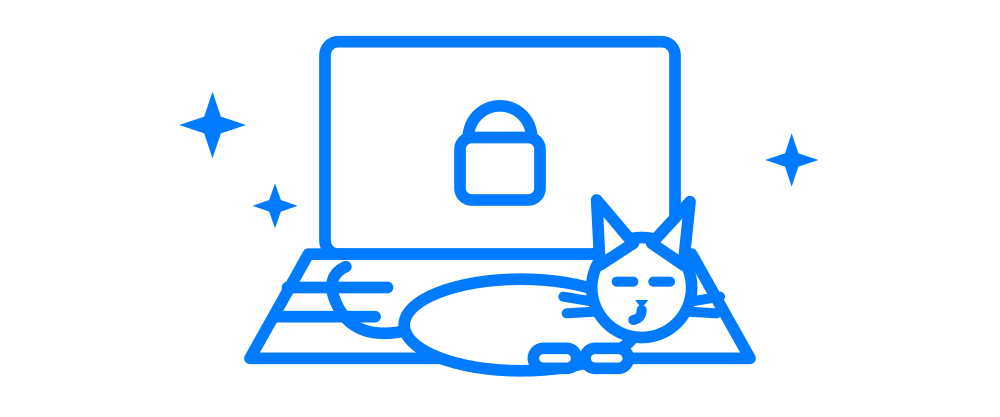

<p align="center">
  <picture>
    <source media="(prefers-color-scheme: dark)" srcset="assets/logo-dark.png">
    
  </picture>
</p>

<p align="center">
  <a href="https://github.com/mkupermann/mackeyboardcleaner/releases/latest"></a>
</p>

A macOS menu bar app that disables all keyboard input, so you can wipe your keyboard without sending "asdfghjkl" to your team chat, closing seventeen tabs, or replying "k" to your boss.

Click the keyboard symbol in the menu bar to block input, click the lock to release it. Blocking is system-wide. As a safety net, it auto-unlocks after 5 minutes with a countdown next to the lock — in case your mouse dies mid-cleaning and you'd otherwise be locked out of your own computer like a cat in front of a closed door.

## Requirements

- macOS 12.0 (Monterey) or later, Apple Silicon or Intel
- A dirty keyboard (you have one, look closer)

## Installation

### Download (recommended)

Grab `KeyboardCleaner-<version>.dmg` from the [latest release](https://github.com/mkupermann/mackeyboardcleaner/releases/latest), open it, drag the app to Applications. The binary is universal (Apple Silicon + Intel), Developer ID signed, and notarized by Apple — Gatekeeper lets it in without hissing.

### Homebrew

```bash
brew install --cask mkupermann/tap/keyboardcleaner
```

### Build from source

Requires the Xcode command line tools:

```bash
git clone https://github.com/mkupermann/mackeyboardcleaner.git
cd mackeyboardcleaner
./build_app.sh
open KeyboardCleaner.app
```

To keep it around, move it to your Applications folder first:

```bash
cp -r KeyboardCleaner.app ~/Applications/
open ~/Applications/KeyboardCleaner.app
```

For a quick test without an app bundle you can compile the single source file directly with plain `swiftc`, but the bundle build above is the intended way to run it — it carries the app icon and menu-bar-only behavior. Yes, it's 326 lines of Swift. You can read all of them in the time your cat spends deciding whether to sit on your keyboard.

## Usage

1. Launch the app — a keyboard symbol appears in your menu bar
2. Grant Accessibility permission when prompted (System Settings > Privacy & Security > Accessibility — add KeyboardCleaner and enable it). macOS will ask if you're sure. You're sure.
3. Click the keyboard symbol to block input — the icon changes to a lock with a countdown
4. Clean your keyboard. Scrub with confidence. Your keystrokes go nowhere.
5. Click the lock to re-enable the keyboard (or wait for the 5-minute auto-unlock)

Right-click (or Ctrl-click) the icon for the menu: block/stop blocking, toggle the auto-unlock timer, About, and Quit.

## Quality assurance

For a quick functional test, place your cat on the keyboard and wait for the irritated stare that says "the human has finally lost it." If nothing happens on screen, the app works. If your browser now has 47 tabs of cat videos open, blocking was off -try again after step 2.

<p align="center">
  <picture>
    <source media="(prefers-color-scheme: dark)" srcset="assets/cat-dark.png">
    
  </picture>
</p>

## For cat owners

This app is not just for cleaning. Paws are treated as noise -> a cat walking across the F-row triggers exactly nothing. No emergency Cmd-Tab, no accidentally sent emails, no mysterious purchases. The cat may keep the keyboard warm; your work stays where you left it.

## How it works

The app uses macOS's CGEventTap API to intercept and discard keyboard events (key down, key up, modifier flag changes, and the F-row special functions like brightness, volume, and media keys) before they reach any application. Mouse input and the power button stay live on purpose — they are your way out. While blocking is active, all keyboard input is invisible to the system — whether it comes from fingers, cleaning cloths, or paws. Quitting the app removes the event tap and everything is back to normal, as if nothing ever happened. Which, technically, is true.

## Troubleshooting

### Icon not visible in the menu bar

On MacBooks with a notch, macOS hides menu bar items that don't fit — behind the notch, where inconvenient things go. If your menu bar is crowded, quit another menu bar app to free a slot and the keyboard symbol will slide into view.

### Keyboard still responds when blocked

Accessibility permission isn't properly granted. Check:

1. KeyboardCleaner appears in System Settings > Privacy & Security > Accessibility and is enabled
2. If it was already listed, remove it, restart the app, and grant the permission again
3. Keep the app in your Applications folder or another stable location — moving or rebuilding the app invalidates the granted permission

### Build fails

Install the Xcode command line tools:

```bash
xcode-select --install
```

## Alternatives

This is a small, single-file utility I wrote because I wanted my own minimal version. If you prefer an established tool: [KeyboardCleanTool](https://folivora.ai/keyboardcleantool) (by the BetterTouchTool developer) or [keyboard-cleaner](https://github.com/gltchitm/keyboard-cleaner) cover the same use case. The cat doesn't care either way.

## License

[MIT](LICENSE) — do whatever you want with it. The cat already does.
